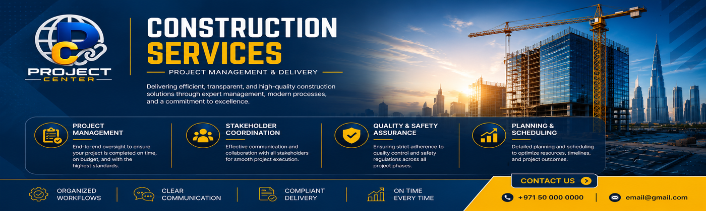
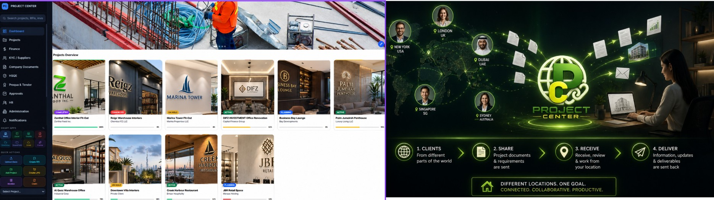
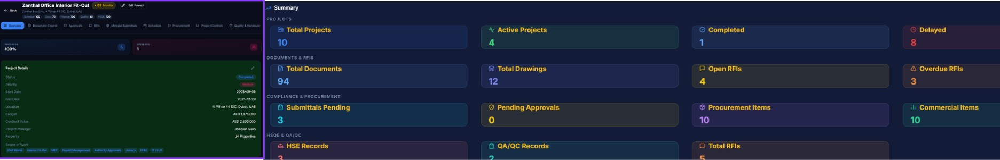
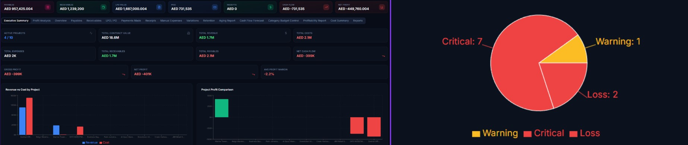
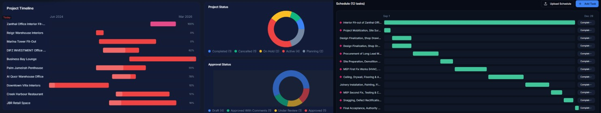

# 👷 REGINA VILLONA  
### Project Delivery Consultant | Construction Coordination Specialist

  

---

## 🚀 PROFESSIONAL OVERVIEW

Experienced construction professional specializing in project delivery coordination, technical documentation, procurement operations, authority approvals, stakeholder management, and digital construction systems across retail fit-out and multidisciplinary projects in the UAE.

Experienced in:

- Project Delivery Coordination
- Retail & Interior Fit-Out
- Construction Operations
- Procurement & Commercial Tracking
- Technical Documentation
- Authority & Landlord Coordination
- QA/QC & Compliance Monitoring
- Digital Construction Systems
- Project Scheduling & Reporting
- Project Close-Out & Handover

---

# 🌐 DIGITAL CONSTRUCTION PLATFORM

Integrated construction coordination platform developed for managing project workflows including document control, procurement tracking, technical approvals, scheduling, QA/QC monitoring, reporting, and commercial operations.

🔗 [Open Project Center Platform](PUT_YOUR_BASE44_LINK_HERE)

---

# 📊 EXECUTIVE OPERATIONS DASHBOARD

  

Centralized dashboard for monitoring project progress, RFIs, approvals, procurement activities, inspections, operational status, and reporting workflows.

---

# 📁 DOCUMENT CONTROL & TECHNICAL SUBMITTALS

  

Technical coordination module for drawings, RFIs, submittals, document registers, approvals, and multidisciplinary construction workflows.

---

# 🛒 PROCUREMENT & COMMERCIAL TRACKING

  

Commercial tracking system for LPOs, quotations, invoices, supplier coordination, payment monitoring, and procurement documentation.

---

# 📅 PROJECT SCHEDULE MONITORING

  

Project schedule overview for monitoring activities, milestones, timelines, progress tracking, and delivery status.

---

# 🛠️ CONSTRUCTION COORDINATION MODULES

| Module | Scope |
|---|---|
| 📁 Document Control | Drawings, RFIs, Technical Submittals |
| 🛒 Procurement | LPO, Quotations, Supplier Tracking |
| 📊 Reports | KPI Monitoring & Project Reporting |
| 🏗️ Project Delivery | Site Coordination & Workflow Monitoring |
| 🧾 Commercial | Invoice & Cost Tracking |
| ✅ QA/QC | MIR, IR, NCR & Snagging |
| 🦺 HSE | Safety Monitoring & Compliance |

---

# 🛠️ CORE EXPERTISE

`Project Delivery`  
`Construction Coordination`  
`Retail Fit-Out`  
`Authority Approvals`  
`Procurement`  
`QA/QC`  
`Technical Documentation`  
`Project Controls`  
`Stakeholder Coordination`  
`Commercial Tracking`

---

# 💻 SOFTWARE & TOOLS

`Base44` `MS Project` `AutoCAD` `Power BI`  
`Excel` `SketchUp` `D5 Render`  
`GitHub` `Google Workspace`

---

# 📄 CURRICULUM VITAE

📥 [Download Resume](./Regina_Villona_CV.pdf)

---

# 📞 CONTACT INFORMATION

📧 villonaregina@gmail.com  

📍 United Arab Emirates  

💼 Available for Remote, Freelance & Project-Based Opportunities

---

  <b>Construction Coordination • Project Delivery • Digital Construction Operations</b>

